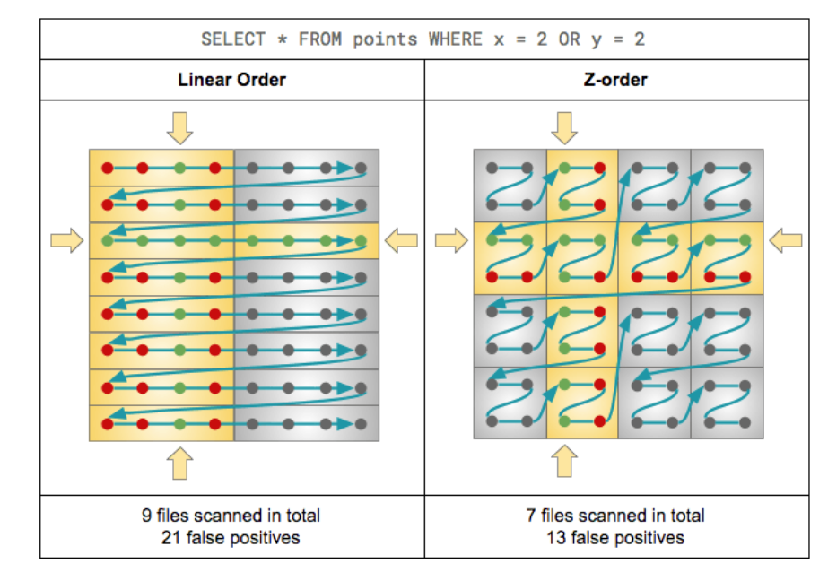
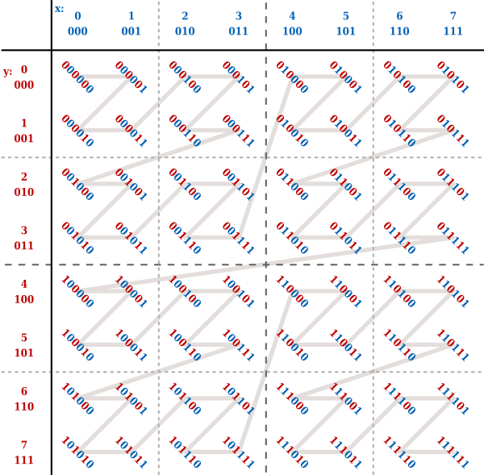

# Space Filling Curves

[toc]
A space-filling curve is a curve whose range reaches every point in a higher dimensional region.(多维数据编码成一维)

## Introduction

我接触到空间填充曲线是因为在 PointTranformerV3 这篇论文中提到，使用这种方法对点云数据进行结构化。认为这是一种对于点云处理比较新颖的方法，同时也能应用在其它地方对数据进行压缩。因此对此进行学习。

首先针对较简单的 Z-order(Morton code) 进行介绍，并分别分析二维和三维的实现代码，以及一些优化技巧。

## Z-order(Morton code)

Z-order 常用在地图场景中，加快对区域的搜索。我学习的目的主要是结构化点云，因此主要是分析代码的实现。在此只是简单提及一下使用 Z-order 优化搜素的应用和优势。

### Z-order 编码地图信息，优化搜素

#### Z-order 和 Linear Order 对比

下图表示了 Linear Order 和 Z-order 进行编码后，搜索 “x = 2 or y - 2” 的信息，可以看到 Z-order 筛选出的信息中，冗余信息更少。也就减少了 IO 使用。

更多分析参考[Processing Petabytes of Data in Seconds with Databricks Delta](https://www.databricks.com/blog/2018/07/31/processing-petabytes-of-data-in-seconds-with-databricks-delta.html)

#### Z-order 在区域搜索中的优势

参考[一位大佬的博客](https://izualzhy.cn/lakehouse-zorder)中的第四小节。

在此引用[一位大佬的博客](https://izualzhy.cn/lakehouse-zorder)中的一段内容：
印象里之前有个高T提过，其实现在硬件变化不大的现状下，无论是生产实践还是论文，都是在针对某些具体领域做优化，很难有“万金油”的绝对优化准则了。类似的优化，还有protobuf的varint编码也是基于实践中发现实际用到的整数都比较小，而 varint 基于小整数有非常好的存储优化效果。

我个人觉得这类是概率型的数据结构（类似跳表），实际情况比较大的概率能够调优，而不是类似索引一定能够加速查询，使用前应该有清楚的认知。

### Z-order 二维代码实现分析

下图一张 8X8 的数据进行 Z-Order 后的结果展示图。可以看到基本是按照左上角->右上角->左下角->右下角的顺序依次编码。随着维度的扩大组成每个角的数目由 1->4->16。也就是每次都会扩大4 ($2^2$)倍。

这种递增的关系，我们可以通过二进制进行表示。x轴方向控制奇数位，y轴方向控制偶数位。即对于 x 轴，1111 -> 01010101, 对于 y 轴 1111 -> 10101010。两者相加得到 11111111($2^8 = 2^4 \times 2 ^ 4$)。即可以表示x 和 y组成的所有坐标(x, y < 16>)。


这种编码方式得到的 x 坐标和 y 坐标进行加法运算时互不干扰。

最终得到的编码值的大小使用二进制表示时，可以清晰的看到。坐标值和编码值之间的关系，高位影响高位，低位影响低位。同时 x 和 y 坐标影响的大小交替变化。最终的结果就是如果对全部的空间编码，根据编码的值遍历所有的坐标点，会看到一个个 “Z”。

具体代码实现思想是使用二分法，假设有个二进制位数为16位数的坐标， 我们在高位插入16位0，合成一个32位数字。
首先将原16位拆成两个8位，分别放在高16位和低16位。
然后在两个16位中，将8位有效值拆分成两个4位，分别放在当前16位数的高8位和低8位中。
依次类推，最终得到将原坐标值编码成 01010101.. 的形式。

2D数据的 Z-order 编码代码如下：

```c++
uint32_t calcZOrder(uint16_t xPos, uint16_t yPos)
{
    static const uint32_t MASKS[] = {0x55555555, 0x33333333, 0x0F0F0F0F, 0x00FF00FF};
    static const uint32_t SHIFTS[] = {1, 2, 4, 8};

    uint32_t x = xPos;  // Interleave lower 16 bits of x and y, so the bits of x
    uint32_t y = yPos;  // are in the even positions and bits from y in the odd;

    x = (x | (x << SHIFTS[3])) & MASKS[3];
    x = (x | (x << SHIFTS[2])) & MASKS[2];
    x = (x | (x << SHIFTS[1])) & MASKS[1];
    x = (x | (x << SHIFTS[0])) & MASKS[0];

    y = (y | (y << SHIFTS[3])) & MASKS[3];
    y = (y | (y << SHIFTS[2])) & MASKS[2];
    y = (y | (y << SHIFTS[1])) & MASKS[1];
    y = (y | (y << SHIFTS[0])) & MASKS[0];

    const uint32_t result = x | (y << 1);
    return result;
}
```

### 三维数据的 Z-order 编码和优化

对于三维数据，我们可以进行类推。在一个 3 位数的值中。第一位放 x 的第 1 位数， 第二位放 y 的第 1 位数， 第三位放 z 的第 1 位数。

但是对于数量庞大的点云，我们要如何进行优化呢？
一个简单是思路就是提前建立好查找表，lkup_x, lkup_y, lkup_z。
key = lkup_x(x) + lkup_y(y) + lkup_z(z)。

对于一个 8 位数的坐标。我们需要建立的表的大小为：
$3 \times 2^8 \times sizeof(int_{64})$
如果是16位(坐标通常用16位数的整数表示)，这个数字将扩大 256 倍。

好在我们的编码主要是通过位运算进行，对于高8位我们可以用同样的方法查找索引表，然后将得到的数据左移24位(3 * 8)。

key_hight = lkup_x(x>>8) + lkup_y(y>>8) + lkup_z(z>>8)
key = key + key_hight<<24

## Hilbert Curve

Hilbert 曲线也是一种空间填充曲线。其产生的空间排列具有更好的空间聚合性。
关于其介绍可以观看 3Blue1Brown 的[视频](https://www.bilibili.com/video/BV1os411B7Hw)。这里主要介绍一种基于 Gray code 生成 Hilbert 曲线的方法。
参考论文 《Programming the Hilbert curve》-- John Skilling

### Gray code

格雷码(Gray code) 是一种二进制数，其提出之初是为了在传送讯号时防止出错。在传统的二进制表示数字中，每一位的权重是不一样的，例如100和001, 同样是1，前者显然有更高的权重。
这会带来一个问题，以十进制数 3 和 4 为例，他们的二进制数分别为 011 和 100。这两个相邻的数字只相差1，但是二进制中三位数都不相同，只信号传输过程中一位数字出错就会带来非常大的误差。为此 Frank Gray 于 1940 年提出了相邻数之间的二进制位只有一位不同的二进制码。

#### Gray code 的构造

对于一个 k 位的 gray code 其手动构造方法如下:

1. 翻转最低位得到下一个格雷码, (例如 000 -> 001).
2. 最右边的 1 的左边的位翻转得到下一个格雷码, (例如 001 -> 011) .
   交替按照上述策略执行。

实际计算过程中由于格雷码自身的一些特性（对称性）可以通过特殊的方法进行计算。
对于一个数字 n, 其格雷码为 G(n), 可以通过公式 $G(n) = n \oplus \lfloor \frac{n}{2} \rfloor$ 进行计算。

### 坐标转 Gray code

部分思想与 Z-Order 编码过程类似。主要是通过坐标的二进制数完成转换。

与 Z-Order 编码的情形类似，我们将坐标转换为二进制。用各个维度坐标的低位组成 Gray Code 的低位， 同理高位组成高位。例如二维坐标中，两个坐标二进制位数是 8 位，则他们可以共同组成 16 位的 gray code。

我们将一个二维平面的坐标通过这种方式转换，将得到的 Gray Code 转换为对应的十进制数并写在原二维平面中对应坐标的位置。如果该数字对应的相邻数正好在附近就相连(附近指两个坐标间的距离恰好为1)。

会发现连线组成的形状以 $2^2$ 为周期重复。这个形状也是 Hilbert 曲线中的单位曲线（即完整的曲线都通过将该部分旋转，再连接组合而成）。

### Gray code 到 Hilbert 曲线

在得到 Gray code 后，我们还需要进一步处理。处理的目的是能够将得到的 Gray Code 转成 十进制后，对应的值能够在坐标系中完成的连成 Hilbert 曲线。

为方便想象和理解，我们以二进制为例。假设低位的两位分别是 $x_0$ 和 $x_1$, 我们将 $x_0$ 和 $x_1$ 的值交换后会发现原来的形状沿着 y = x 发生了翻转。再将其中的 $x_0$ 位取反，得到的形状是将最初非变化的形状逆时针旋转了90°。 也就是说我们只要将合适的位置的 Gray Code 进行上面的两种操作就能将整个坐标系上对应 Gray Code 按顺序连接后组成 Hilbert 曲线。

更多细节和解释可以参考原论文。